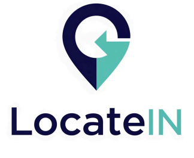

  

# 📍 LocateIN

**Navegação indoor inteligente baseada em sensores móveis nativos e colaboração comunitária.**

O LocateIN é um aplicativo inovador que permite a localização precisa dentro de ambientes internos — como shoppings, hospitais, universidades, escolas e feiras — utilizando plantas personalizadas, sensores do próprio dispositivo e contribuição ativa da comunidade de usuários.

## 🚀 Funcionalidades

- Upload ou desenho de mapas internos (PDF, imagem ou esboço)
- Localização com sensores inerciais (giroscópio, barômetro, bússola)
- Identificação automática de locais com base na direção e movimentação
- Marcação colaborativa de lojas, salas, corredores e rotas
- Sistema inteligente de área (WayBlocks) com preenchimento estimado
- Busca por locais, rotas e informações associadas
- Suporte a Realidade Aumentada (AR) para sobreposição de nomes e direções
- Sistema SOS com envio de localização exata
- Integração futura com controle parental, DNS inteligente e rastreadores de objetos

## 👤 Perfis de Usuário

- **Usuário Comum** – navega e contribui com marcações
- **Visitante** – navega sem salvar dados
- **Profissional** – define mapas de ambientes institucionais
- **Corporativo** – empresas com perfil oficial e recursos avançados

## 🏗️ Casos de Uso

- **Shoppings** – localização de lojas e quiosques
- **Universidades** – orientação por blocos, salas e laboratórios
- **Hospitais** – visitas guiadas a alas e pacientes
- **Feiras/Pavilhões** – mapas interativos de estandes e corredores
- **Trilhas e áreas abertas** – marcação colaborativa de trajetos

## 🧠 Tecnologias previstas

- Navegação offline baseada em planta e sensores
- Módulo de aprendizado coletivo para ajuste e correção de mapas
- Realidade Aumentada (AR) integrada à câmera do dispositivo
- Sistemas auxiliares: DNS interno, integração com dispositivos e redes locais

## 📦 Status

Este projeto encontra-se em **fase de desenvolvimento privado**.  
Protótipo funcional em andamento com foco em provas de conceito, validação técnica e estruturação comercial.

## 📄 Licença

Este projeto é **proprietário e todos os direitos estão reservados**.

Nenhuma parte deste código, documentação ou interface pode ser copiada, modificada, distribuída ou utilizada sem autorização prévia e expressa do autor.

Para propostas de licenciamento, parcerias ou aquisição comercial, entre em contato.

---
